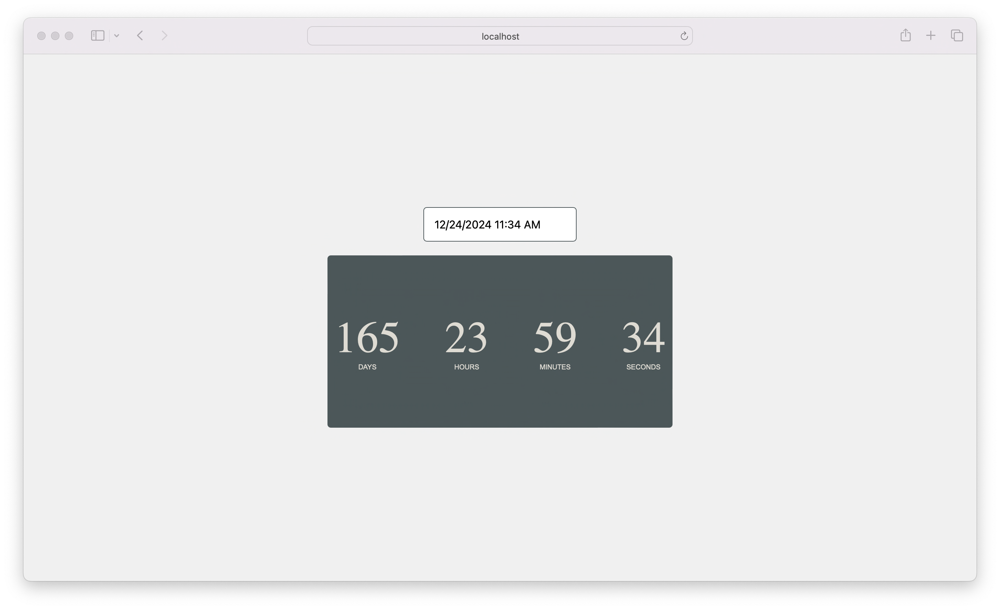

# ChronoTimer

**ChronoTimer** is a digital tool designed to create and manage countdown timers conveniently. This project is useful for anyone needing to accurately time and visualize the remaining time for events, tasks, or specific activities. It is accessible for a wide range of users, from individuals managing personal time to teams coordinating activities in collaborative projects.

## Screenshots



## Tech Stack

**Client:** HTML, CSS, JavaScript, React, NPM

## Prerequisites

Before you begin, ensure you have the following installed:

- **Node.js**: ChronoTimer requires Node.js to run. You can download it from [nodejs.org](https://nodejs.org/).
- **Visual Studio Code (optional)**: You can download it from [Visual Studio Code](https://code.visualstudio.com/).

## Installation Steps

### Download the project:

1. Download the project from the repository or directly as a ZIP file.

### Clone the repository (alternative):

1. Clone the repository to your local machine:

   ```bash
   git clone https://github.com/jorgedoiany/chrono-timer-app.git

   ```

2. Navigate into the project directory:

   ```bash
   cd chrono-timer
   ```

### Install dependencies:

1. Install the necessary dependencies using npm:

   ```bash
   npm install
   ```

## Running the Application

### Start the development server:

1. To start ChronoTimer in development mode, run:

   ```bash
   npm start

   ```

2. Open your browser and navigate to http://localhost:3000 to view ChronoTimer.

### Build for production:

1. To build ChronoTimer for production, use:

   ```bash
   npm run build
   ```

This command bundles the app into static files for deployment.

## Additional Notes

- Make sure you have Node.js installed globally on your machine.
- If you prefer, you can use Visual Studio Code for editing the codebase.
- You can also download the project directly as a ZIP file from the repository.
- This project uses npm to manage dependencies and run scripts.
- For more information on React, visit [reactjs.org](https://react.dev/).

That's it! You should now be able to see and use the **ChronoTimer** application in your browser.

## Author

- [@jorgedoiany](https://github.com/jorgedoiany)
